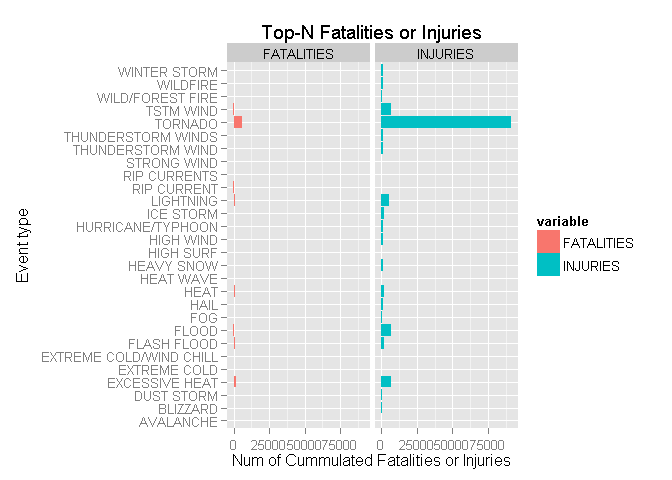
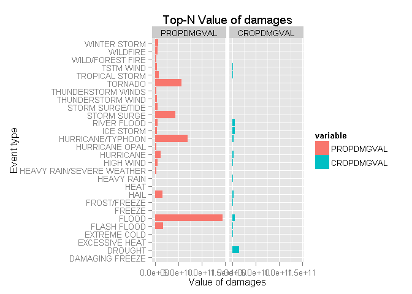

# Weather events and its health and economic impact based on NOOA storm db
by andhdo  

# Preliminars

### Synopsys
NOOA (National Oceanic and Atmospheric Administration) is an U.S institute that collects data about weather events around hundred of years and joining this information with economic and health prolems reported.

With information of NOOA from the year 1950 to November 2011, this project demonstrates that this kind of weather events has been responsible to the most impactant consequences in health and ecomonic life of people in the U.S.

# Data Processing

We are going to show the loading and cleansing process around this subchapters
starting with the preparation of the environment to do this processing

### Prerrequisites Loading

```r
library(ggplot2)
library(reshape2)
```


### Preparation of the environment 

Source data for this exercise are downloaded from Coursera's RepResearch website.
Let's start declaring some global names about the location of files


```r
# declare global names
target_zip_dir <- "."
target_zip_filename <- "repdata_data_StormData"
target_zip_complete <- paste0(target_zip_dir,'/',target_zip_filename, '.csv.bz2')
source_zip_file <- "https://d396qusza40orc.cloudfront.net/repdata%2Fdata%2FStormData.csv.bz2"
subset_filename <- "_subset_data.csv"
all_dataset_filename <- paste0(target_zip_filename,'.csv')
TOP_N <- 20
```

### Loading the data

Using auxiliar functions to download and load the file, Let's start reading the dataset


```r
# download the file & uncompress it
download_raw_package <- function() {
  
  # set the download params
  
  # if extraction folder exists, skip
  if(!file.exists(target_zip_complete)) {
    dir.create(target_zip_dir,recursive = TRUE)
    if(!file.exists(target_zip_complete)) {
      download.file(source_zip_file,destfile=target_zip_complete)  
    } 
  }
}

# loading the dataset for in-memory manipulation
load_data <- function() {
  
  csv_handle <- bzfile(target_zip_complete,all_dataset_filename)
  
  # read the raw dataset
  tmp_dataset <- read.csv2(csv_handle, sep = ",", stringsAsFactors = FALSE)
  
  unlink(csv_handle)
  
  tmp_dataset  
  
}


# execution of actions
download_raw_package()
all_dataset <- load_data()
```


### Review of the dataset
Let's expore some basic information of the dataset as it's structure:


```r
str(all_dataset)
```

```
## 'data.frame':	902297 obs. of  37 variables:
##  $ STATE__   : chr  "1.00" "1.00" "1.00" "1.00" ...
##  $ BGN_DATE  : chr  "4/18/1950 0:00:00" "4/18/1950 0:00:00" "2/20/1951 0:00:00" "6/8/1951 0:00:00" ...
##  $ BGN_TIME  : chr  "0130" "0145" "1600" "0900" ...
##  $ TIME_ZONE : chr  "CST" "CST" "CST" "CST" ...
##  $ COUNTY    : chr  "97.00" "3.00" "57.00" "89.00" ...
##  $ COUNTYNAME: chr  "MOBILE" "BALDWIN" "FAYETTE" "MADISON" ...
##  $ STATE     : chr  "AL" "AL" "AL" "AL" ...
##  $ EVTYPE    : chr  "TORNADO" "TORNADO" "TORNADO" "TORNADO" ...
##  $ BGN_RANGE : chr  "0.00" "0.00" "0.00" "0.00" ...
##  $ BGN_AZI   : chr  "" "" "" "" ...
##  $ BGN_LOCATI: chr  "" "" "" "" ...
##  $ END_DATE  : chr  "" "" "" "" ...
##  $ END_TIME  : chr  "" "" "" "" ...
##  $ COUNTY_END: chr  "0.00" "0.00" "0.00" "0.00" ...
##  $ COUNTYENDN: logi  NA NA NA NA NA NA ...
##  $ END_RANGE : chr  "0.00" "0.00" "0.00" "0.00" ...
##  $ END_AZI   : chr  "" "" "" "" ...
##  $ END_LOCATI: chr  "" "" "" "" ...
##  $ LENGTH    : chr  "14.00" "2.00" "0.10" "0.00" ...
##  $ WIDTH     : chr  "100.00" "150.00" "123.00" "100.00" ...
##  $ F         : int  3 2 2 2 2 2 2 1 3 3 ...
##  $ MAG       : chr  "0.00" "0.00" "0.00" "0.00" ...
##  $ FATALITIES: chr  "0.00" "0.00" "0.00" "0.00" ...
##  $ INJURIES  : chr  "15.00" "0.00" "2.00" "2.00" ...
##  $ PROPDMG   : chr  "25.00" "2.50" "25.00" "2.50" ...
##  $ PROPDMGEXP: chr  "K" "K" "K" "K" ...
##  $ CROPDMG   : chr  "0.00" "0.00" "0.00" "0.00" ...
##  $ CROPDMGEXP: chr  "" "" "" "" ...
##  $ WFO       : chr  "" "" "" "" ...
##  $ STATEOFFIC: chr  "" "" "" "" ...
##  $ ZONENAMES : chr  "" "" "" "" ...
##  $ LATITUDE  : chr  "3040.00" "3042.00" "3340.00" "3458.00" ...
##  $ LONGITUDE : chr  "8812.00" "8755.00" "8742.00" "8626.00" ...
##  $ LATITUDE_E: chr  "3051.00" "0.00" "0.00" "0.00" ...
##  $ LONGITUDE_: chr  "8806.00" "0.00" "0.00" "0.00" ...
##  $ REMARKS   : chr  "" "" "" "" ...
##  $ REFNUM    : chr  "1.00" "2.00" "3.00" "4.00" ...
```

```r
# summary doesn not gives display relevant inotmation and it's ommited
# summary(all_dataset)
```
and some of the variable categories


```r
sort(unique(all_dataset$EVTYPE))[1:21]
```

```
## Warning: cerrando la conenexion 5 (./repdata_data_StormData.csv.bz2) que
## no esta siendo utilizada
```

```
##  [1] "   HIGH SURF ADVISORY"  " COASTAL FLOOD"        
##  [3] " FLASH FLOOD"           " LIGHTNING"            
##  [5] " TSTM WIND"             " TSTM WIND (G45)"      
##  [7] " WATERSPOUT"            " WIND"                 
##  [9] "?"                      "ABNORMAL WARMTH"       
## [11] "ABNORMALLY DRY"         "ABNORMALLY WET"        
## [13] "ACCUMULATED SNOWFALL"   "AGRICULTURAL FREEZE"   
## [15] "APACHE COUNTY"          "ASTRONOMICAL HIGH TIDE"
## [17] "ASTRONOMICAL LOW TIDE"  "AVALANCE"              
## [19] "AVALANCHE"              "BEACH EROSIN"          
## [21] "Beach Erosion"
```

```r
unique(all_dataset$PROPDMGEXP)
```

```
##  [1] "K" "M" ""  "B" "m" "+" "0" "5" "6" "?" "4" "2" "3" "h" "7" "H" "-"
## [18] "1" "8"
```

```r
unique(all_dataset$CROPDMGEXP)
```

```
## [1] ""  "M" "K" "m" "B" "?" "0" "k" "2"
```

### Preprocessing

Preprocessing the dataset to be more easily manipulated in further analysis.
From the raw dataset, we can subset specific variables to be analyzed: 

* EVTYPE classification of events
* FATALITIES impact in health indicator
* INJURIES impact in health indicator
* PROPDMG property damage (economic impact) indicator
* PROPDMGEXP  additional exponent
* CROPDMG farming damage (economic impact) indicator
* CROPDMGEXP  additional exponent

Specific transformations of the colums are made and commented in the code
to be more easily manipulated.


```r
preprocess_dataset <- function(tmp_dataset) {
  # preprocess the dataset
  
  selected_cols <- c("EVTYPE", "FATALITIES", "INJURIES", "PROPDMG", "PROPDMGEXP", "CROPDMG", "CROPDMGEXP")
  sub_ds   <- tmp_dataset[selected_cols]

  # a: eventtype-column: uppercased
  # b: fatalities-column: must be numeric
  # c: injuries-column: must be numeric
  # d: propdmgexp-column: is an indicator of the exponent to be applied for the value (+,-,? are considered invalid)
  # e: cropdmgexp-column: is an indicator of the exponent to be applied for the value (+,-,? are considered invalid)

  sub_ds$EVTYPE      <- toupper(sub_ds$EVTYPE)
  sub_ds$FATALITIES  <- as.numeric(sub_ds$FATALITIES)
  sub_ds$INJURIES    <- as.numeric(sub_ds$INJURIES)
  sub_ds$PROPDMG     <- as.numeric(sub_ds$PROPDMG)
  sub_ds$CROPDMG     <- as.numeric(sub_ds$CROPDMG)
  #  
  sub_ds$PROPEXP[sub_ds$PROPDMGEXP == "H"]  <- 100
  sub_ds$PROPEXP[sub_ds$PROPDMGEXP == "h"]  <- 100
  sub_ds$PROPEXP[sub_ds$PROPDMGEXP == "K"]  <- 1000
  sub_ds$PROPEXP[sub_ds$PROPDMGEXP == "M"]  <- 1e+06
  sub_ds$PROPEXP[sub_ds$PROPDMGEXP == "m"]  <- 1e+06
  sub_ds$PROPEXP[sub_ds$PROPDMGEXP == "B"]  <- 1e+09
  sub_ds$PROPEXP[sub_ds$PROPDMGEXP == "" ]  <- 1
  sub_ds$PROPEXP[sub_ds$PROPDMGEXP == "0"]  <- 1e+00  
  sub_ds$PROPEXP[sub_ds$PROPDMGEXP == "1"]  <- 1e+01  
  sub_ds$PROPEXP[sub_ds$PROPDMGEXP == "2"]  <- 1e+02
  sub_ds$PROPEXP[sub_ds$PROPDMGEXP == "3"]  <- 1e+03
  sub_ds$PROPEXP[sub_ds$PROPDMGEXP == "4"]  <- 1e+04
  sub_ds$PROPEXP[sub_ds$PROPDMGEXP == "5"]  <- 1e+05
  sub_ds$PROPEXP[sub_ds$PROPDMGEXP == "6"]  <- 1e+06
  sub_ds$PROPEXP[sub_ds$PROPDMGEXP == "7"]  <- 1e+07
  sub_ds$PROPEXP[sub_ds$PROPDMGEXP == "8"]  <- 1e+08
  sub_ds$PROPEXP[sub_ds$PROPDMGEXP == "+"]  <- 0
  sub_ds$PROPEXP[sub_ds$PROPDMGEXP == "-"]  <- 0
  sub_ds$PROPEXP[sub_ds$PROPDMGEXP == "?"]  <- 0
  #
  sub_ds$CROPEXP[sub_ds$CROPDMGEXP == "H"]  <- 100
  sub_ds$CROPEXP[sub_ds$CROPDMGEXP == "h"]  <- 100
  sub_ds$CROPEXP[sub_ds$CROPDMGEXP == "K"]  <- 1000
  sub_ds$CROPEXP[sub_ds$CROPDMGEXP == "M"]  <- 1e+06
  sub_ds$CROPEXP[sub_ds$CROPDMGEXP == "m"]  <- 1e+06
  sub_ds$CROPEXP[sub_ds$CROPDMGEXP == "B"]  <- 1e+09
  sub_ds$CROPEXP[sub_ds$CROPDMGEXP == "" ]  <- 1
  sub_ds$CROPEXP[sub_ds$CROPDMGEXP == "0"]  <- 1e+00  
  sub_ds$CROPEXP[sub_ds$CROPDMGEXP == "1"]  <- 1e+01  
  sub_ds$CROPEXP[sub_ds$CROPDMGEXP == "2"]  <- 1e+02
  sub_ds$CROPEXP[sub_ds$CROPDMGEXP == "3"]  <- 1e+03
  sub_ds$CROPEXP[sub_ds$CROPDMGEXP == "4"]  <- 1e+04
  sub_ds$CROPEXP[sub_ds$CROPDMGEXP == "5"]  <- 1e+05
  sub_ds$CROPEXP[sub_ds$CROPDMGEXP == "6"]  <- 1e+06
  sub_ds$CROPEXP[sub_ds$CROPDMGEXP == "7"]  <- 1e+07
  sub_ds$CROPEXP[sub_ds$CROPDMGEXP == "8"]  <- 1e+08
  sub_ds$CROPEXP[sub_ds$CROPDMGEXP == "+"]  <- 0
  sub_ds$CROPEXP[sub_ds$CROPDMGEXP == "-"]  <- 0
  sub_ds$CROPEXP[sub_ds$CROPDMGEXP == "?"]  <- 0

  # f. propdmgval-column: compute according the data and exponent
  sub_ds$PROPDMGVAL <- sub_ds$PROPDMG * sub_ds$PROPEXP

  # g. cropdmgval-column: compute according the data and exponent
  sub_ds$CROPDMGVAL <- sub_ds$CROPDMG * sub_ds$CROPEXP
  
  # return the sub-dataset  
  sub_ds  
  
}

# execution of actions
sub_dataset <- preprocess_dataset(all_dataset)
```


# Results

## Population Health Perspective

Let's see the plot that shows the top-N most harmful event types with respect to the population health 

```r
# make a top-N computation starting with the cummulative computation of 
# the fatalities over the years

health_ds_fatalities      <- aggregate(FATALITIES ~ EVTYPE, data = sub_dataset, FUN=sum, na.rm = TRUE)
health_ds_fatalities_topN <- health_ds_fatalities[order(health_ds_fatalities$FATALITIES,decreasing = TRUE),][1:TOP_N,]

# ... and doing the same for injuries category
health_ds_injuries        <- aggregate(INJURIES ~ EVTYPE, data = sub_dataset, FUN=sum, na.rm = TRUE)
health_ds_injuries_topN   <- health_ds_injuries[order(health_ds_injuries$INJURIES, decreasing=TRUE),][1:TOP_N,]

# concatenating the two datasets and reshaping it to be plotted after
health_ds_topN <- rbind( melt(health_ds_fatalities_topN,id.vars=c("EVTYPE")), 
                         melt(health_ds_injuries_topN,id.vars=c("EVTYPE"))) 

# represent in two facets. 
ggplot(health_ds_topN, aes(x = EVTYPE, y = value, fill=variable)) + 
  geom_bar(stat = "identity") + facet_grid(. ~ variable) + 
  coord_flip() + 
  labs(x = "Event type", y = "Num of Cummulated Fatalities or Injuries", title = "Top-N Fatalities or Injuries")
```

 

```r
# varying position  parameter {stack/dodge} could be another way to represent the data
```

This shows that the tornado is the most harmful event type over the evaluated period

### Economic impact perspective


```r
# make a top-N computation starting with the cummulative computation of 
# the property damages over the years
economic_ds_propdamage  <- aggregate(PROPDMGVAL ~ EVTYPE, data = sub_dataset, FUN=sum, na.rm = TRUE)
economic_ds_propdamage_topN <- economic_ds_propdamage[order(economic_ds_propdamage$PROPDMGVAL,decreasing = TRUE),][1:TOP_N,]

# ... and doing the same for the crop category

economic_ds_cropdamage  <- aggregate(CROPDMGVAL ~ EVTYPE, data = sub_dataset, FUN=sum, na.rm = TRUE)
economic_ds_cropdamage_topN <- economic_ds_cropdamage[order(economic_ds_cropdamage$CROPDMGVAL,decreasing = TRUE),][1:TOP_N,]

# concatenating the two datasets and reshaping it to be plotted after
economic_ds_topN <- rbind( melt(economic_ds_propdamage_topN,id.vars=c("EVTYPE")), 
                           melt(economic_ds_cropdamage_topN,id.vars=c("EVTYPE"))) 

# represent in two facets. 
ggplot(economic_ds_topN, aes(x = EVTYPE, y = value, fill=variable)) + 
  geom_bar(stat = "identity") + facet_grid(. ~ variable) + 
  coord_flip() + 
  labs(x = "Event type", y = "Value of damages", title = "Top-N Value of damages")
```

 

```r
# varying position  parameter {stack/dodge} could be another way to represent the data
```
We can see that the most notable events that causes most economic consequences are
floods, hurricane/typhon, tornado, storm-surge, hail and drought

### Conclusion
From the source dataset we can found that for population health the most harmful event is the tornado while floods,hurricane/typhon, and tornado again have the most economic impact. 


